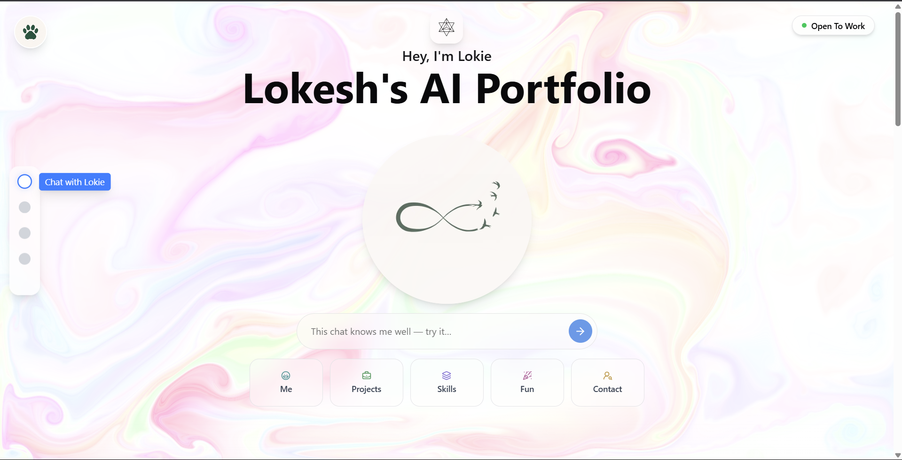

 
# Lokie — My Digital Twin AI

A chill yet sharp digital reflection of me — Lokesh, a 19-year-old AI & DS student at IIITDM Kurnool. This isn’t just a chatbot. It’s my personality, mindset, and hustle packed into one conversational layer. Ask it about me, my work, my quirks, or how I think — it’s me on the other side of the screen.

> “If it ain’t about me or what I do, try another tool, bro.” – Lokie

---

## What’s This?

Lokie is my AI-powered digital twin, trained on my real-world context:
- My thoughts, interests, and projects
- My learning style and tech stack
- My goals, growth, and (yeah) even my struggles

This portfolio mixes tech with vibe — built to reflect how I think and work in real life. It’s not about being perfect. It’s about being real, curious, and clear-headed.

---

## Tech Stack

- Built using React + TypeScript
- Integrated with an LLM backend (Groq API)
- Deploy-ready with Vercel
- Context injection using a custom system prompt

---

## What Can You Ask Lokie?

- Anything about me, my projects, skills, or goals
- My takes on AI, tech, productivity, or fitness
- Chill stuff like “Why TFI?” or “Why the Royal Enfield dream?”

It won’t entertain random trivia or sci-fi — that’s outside Lokie’s world.

---

## Reach Out

- Email: [lokeshbabukolamala@gmail.com](mailto:lokeshbabukolamala@gmail.com)  
- LinkedIn: [linkedin.com/in/lokeshbabu-kolamala](https://www.linkedin.com/in/lokeshbabu-kolamala)  
- GitHub: [github.com/Lokesh-916](https://github.com/Lokesh-916)

Looking for internships? Hit the "Open to Work" button on the homepage.

---
